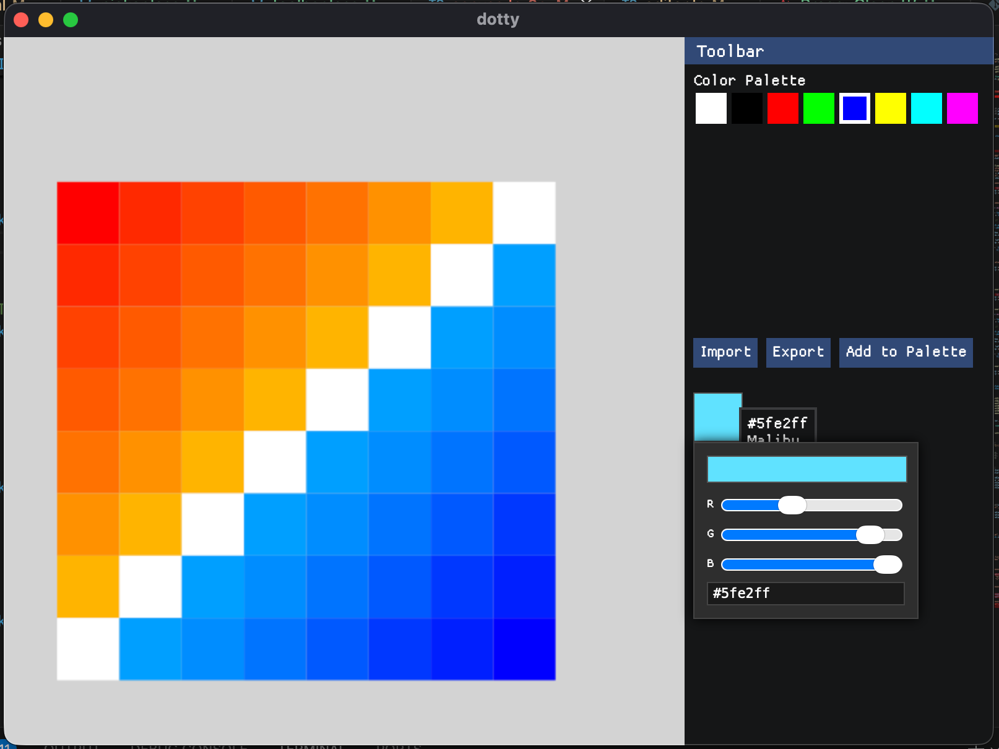

# Dotty

>A fast and simple pixel art editor written in Rust and TypeScript

`Made for Hack Club Summer of Making`

## ⚠️ Dotty is still under heavy development and is not actually usable

## Feature roadmap
- [x] Pixel editing
    - [x] Zoom & Pan
    - [ ] Improved mouse detection
    - [ ] Tools
        - [x] Pen
        - [ ] Eraser
        - [ ] Fill
- [ ] Colors
    - [x] Palette
    - [x] Color picker
    - [ ] Import / Export palettes
    - [ ] Add colors to palette
- [ ] Filesystem
    - [ ] Save / load `.dtypx` JSON
    - [ ] Export other formats (`.png`, `.jpg`, etc.)
    - [ ] Import PNG ?
### Credits
- **Chirag Mehta** - creator of Name That Color (library for getting color names from hex codes)
